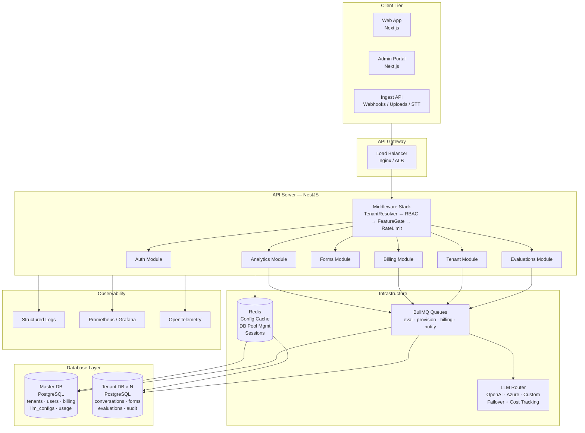
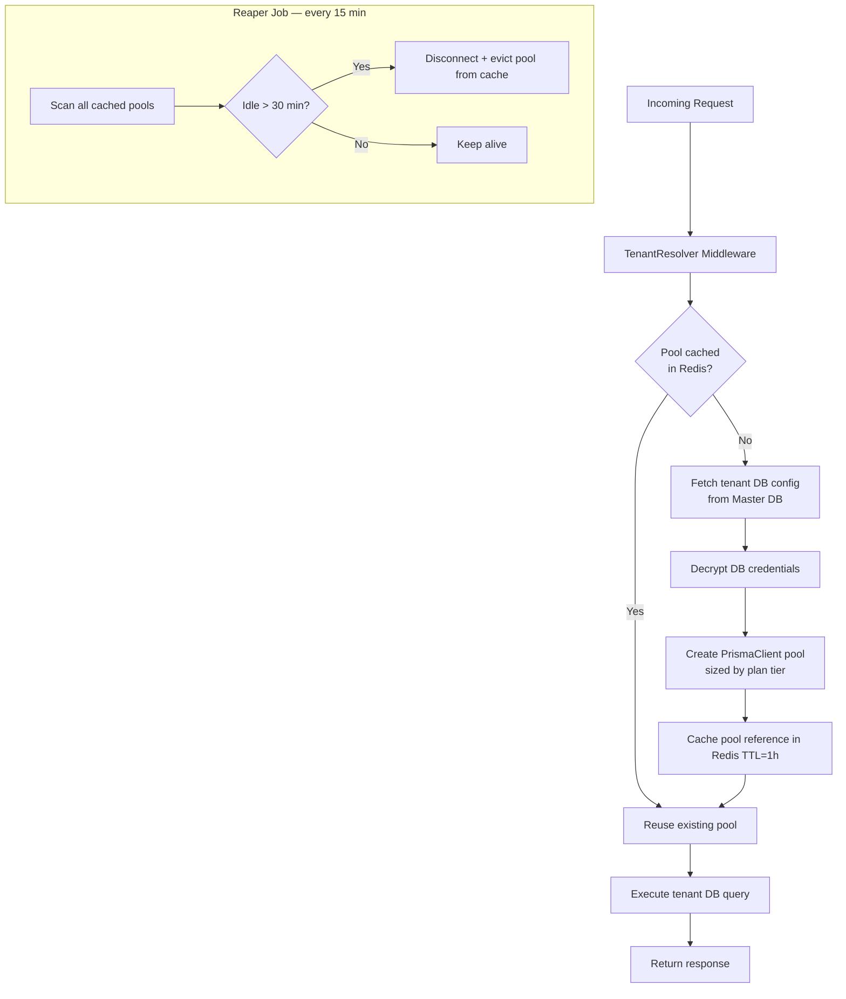

# QA Platform — Technical Architecture

## Text Overview

```
┌─────────────────────────────────────────────────────────────────────────────────────┐
│                              QA PLATFORM (SaaS)                                     │
│                                                                                     │
│  ┌──────────────┐   ┌──────────────┐   ┌───────────────────────────────────────┐  │
│  │  Tenant Web  │   │  Admin Portal│   │  Public Ingest API / Webhooks / STT   │  │
│  │  App (Next)  │   │  (Next.js)   │   │  (CRM integrations, uploads)          │  │
│  └──────┬───────┘   └──────┬───────┘   └──────────────────────┬────────────────┘  │
│         └──────────────────┴────────────────────────────────────┘                  │
│                                     │ HTTPS / TLS                                  │
│  ┌──────────────────────────────────▼──────────────────────────────────────────┐   │
│  │                      API Gateway / Load Balancer (nginx / AWS ALB)           │   │
│  └──────────────────────────────────┬──────────────────────────────────────────┘   │
│                                     │                                               │
│  ┌──────────────────────────────────▼──────────────────────────────────────────┐   │
│  │                       API Server  (NestJS / Node.js)                         │   │
│  │                                                                              │   │
│  │  ┌──────────┬──────────┬───────────┬────────────┬───────────┬───────────┐  │   │
│  │  │  Auth    │  Tenant  │   Forms   │ Evaluations│  Billing  │ Analytics │  │   │
│  │  │  Module  │  Module  │   Module  │   Module   │  Module   │  Module   │  │   │
│  │  └──────────┴──────────┴───────────┴────────────┴───────────┴───────────┘  │   │
│  │                                                                              │   │
│  │  ┌─────────────────────────────────────────────────────────────────────┐   │   │
│  │  │  Middleware: Tenant Resolver → RBAC → Feature Gate → Rate Limiter   │   │   │
│  │  └─────────────────────────────────────────────────────────────────────┘   │   │
│  └──────┬────────────────────────────────────────────────┬────────────────────┘   │
│         │                                                │                         │
│  ┌──────▼──────────┐   ┌───────────────────────┐  ┌─────▼────────────────────┐   │
│  │  Redis           │   │   Queue Layer (BullMQ)│  │  LLM Router              │   │
│  │  - Tenant config │   │   - eval:process      │  │  - OpenAI                │   │
│  │  - DB pool mgmt  │   │   - eval:escalate     │  │  - Azure OpenAI          │   │
│  │  - Sessions      │   │   - tenant:provision  │  │  - Custom Endpoint       │   │
│  │  - Rate limits   │   │   - billing:sync      │  │  - Failover + Cost track │   │
│  │  - Form schemas  │   │   - notify:send       │  └──────────────────────────┘   │
│  └─────────────────┘   │   - report:export     │                                  │
│                         └───────────────────────┘                                  │
│                                                                                     │
│  ┌───────────────────────────────────────────────────────────────────────────────┐ │
│  │                           Database Layer                                       │ │
│  │                                                                               │ │
│  │  ┌────────────────────────────┐    ┌──────────────────────────────────────┐  │ │
│  │  │  Master DB (PostgreSQL)    │    │  Tenant DB per customer (PostgreSQL) │  │ │
│  │  │  - tenants                 │    │  - conversations                     │  │ │
│  │  │  - users                   │    │  - form_definitions (versioned)      │  │ │
│  │  │  - subscriptions           │    │  - evaluations (layered response)    │  │ │
│  │  │  - invoices                │    │  - workflow_queues                   │  │ │
│  │  │  - llm_configs             │    │  - deviation_records                 │  │ │
│  │  │  - escalation_rules        │    │  - audit_logs                        │  │ │
│  │  │  - blind_review_settings   │    │  - workflow_states                   │  │ │
│  │  │  - usage_metrics           │    └──────────────────────────────────────┘  │ │
│  │  └────────────────────────────┘                                               │ │
│  └───────────────────────────────────────────────────────────────────────────────┘ │
│                                                                                     │
│  ┌───────────────────────────────────────────────────────────────────────────────┐ │
│  │                       Observability                                            │ │
│  │   Structured Logs (stdout/JSON) → Log Aggregator                              │ │
│  │   Metrics (Prometheus) → Grafana dashboards                                   │ │
│  │   Traces (OpenTelemetry) → per-tenant request tracing                         │ │
│  │   Alerts: SLO breaches, queue depth, LLM errors, billing events               │ │
│  └───────────────────────────────────────────────────────────────────────────────┘ │
└─────────────────────────────────────────────────────────────────────────────────────┘
```

---

## Mermaid Diagram — System Architecture



---

## Mermaid Diagram — Core Evaluation Workflow

```mermaid
sequenceDiagram
    participant C as Conversation Ingest
    participant API as API Server
    participant Q as BullMQ Worker
    participant LLM as LLM Router
    participant TDB as Tenant DB
    participant QA as QA Reviewer
    participant VER as Verifier
    participant ANA as Reports and Analytics
    participant LOOP as Continuous Learning Loop

    C->>API: POST /conversations (ingest)
    API->>TDB: store conversation (PENDING)
    API->>Q: enqueue eval:process job

    Q->>TDB: fetch tenant LLM config
    Q->>TDB: fetch tenant published QA form
    alt LLM enabled
        Q->>LLM: fill form (schema-validated prompt)
        LLM-->>Q: ai_response_data + confidence
        Q->>TDB: store evaluation
    else LLM disabled
        Q->>TDB: skip AI and mark QA_PENDING
    end

    Q->>TDB: enqueue QA review queue entry
    QA->>API: GET /evaluations/queue/qa
    QA->>API: POST /evaluations/:id/qa-submit
    API->>TDB: store qa_adjusted_data, compute deviation
    API->>TDB: route to verifier queue (escalate if deviation > threshold)

    VER->>API: GET /evaluations/queue/verifier
    VER->>API: POST /evaluations/:id/verifier-approve OR verifier-modify
    API->>TDB: store verifier_final_data and resolve final_response_data
    API->>TDB: compute final_score and lock evaluation (LOCKED)
    API->>TDB: write audit log entry

    API->>ANA: publish final score for reports and analytics
    ANA->>LOOP: feed top overrides and deviation trends
    LOOP->>TDB: update rubric and prompt tuning inputs
```

### Canonical State Flow

1. Conversation received.
2. Fetch tenant LLM config.
3. Fetch tenant published QA form.
4. AI fills tenant form (or skip AI if disabled).
5. Store evaluation.
6. QA review queue.
7. Verifier review.
8. Final score locked.
9. Reports and analytics.
10. Continuous learning loop.

### If LLM Is Disabled

1. Skip AI stage.
2. QA evaluates directly.
3. Verifier flow remains unchanged.

---

## Mermaid Diagram — Tenant DB Connection Pool Lifecycle



---

## Key Architecture Decisions

| Decision | Choice | Rationale |
|---|---|---|
| API framework | NestJS (TypeScript) | Modular, DI, guards/interceptors map to RBAC + feature gates |
| ORM | Prisma | Type-safe, migration-safe, dual-schema support |
| Queue | BullMQ (Redis-backed) | Reliable, retries, priority queues, job visibility |
| Per-tenant DB | Separate PostgreSQL per tenant | Strict isolation, no cross-tenant query risk |
| DB pool strategy | Lazy-loaded, Redis-cached per tenant | Avoids cold-open cost on every request |
| Auth | JWT (access + refresh) with short-lived access tokens | Stateless API scaling, rotation support |
| LLM | BYO-LLM with router | Failover, cost tracking, tenant-level control |
| Scoring | Deterministic (published form + answers → same score always) | Auditability, no hidden randomness |
| Blind review | Server-side deterministic hash of agent/QA identity | No client-side bypass possible |
